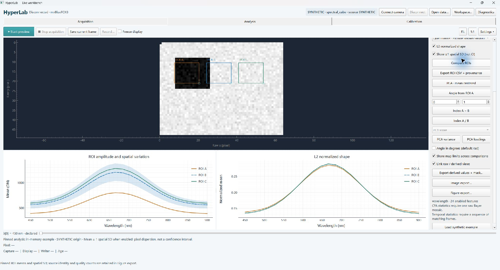

# HyperLab

A local Windows research workbench for inspecting imaging data, comparing regions
and exporting reproducible scientific figures. Offline analysis works without a
camera. An experimental acquisition backend supports the mvBlueFOX3 USB3 Vision
imaging module used in the investigated HinaLea system.


**0.3.1 research preview:** install the explicit branch below. The repository's
default branch is still `recovery/hinalea-local`. Original-code licensing and
public release remain pending; this is not a completed open-source license grant.

- Multiple named rectangle ROIs, raw amplitude and optional L2 shape comparison,
  spatial SD, single-plane intensity distributions, validity masks and recorded-time trends.
- Difference, ratio and angle maps; PCA scores, explained variance and loadings.
- Shared plot data for interactive Qt charts and SVG/PDF/PNG figure bundles.
- NPY/NPZ/ENVI data, explicit source/axis metadata, private reference exchange,
  saved workspace, view and ROI configuration.



This is a native Windows desktop capture at 125% display scale, using the
0.3.1 Windows package and built-in synthetic data. It is not a camera
acquisition or a material identification result. A separate
[offscreen Qt layout render](docs/assets/workbench-synthetic.png) documents layout
checks. [Reproducible figure examples](docs/user/SCIENTIFIC_FIGURES.md)
retain their numerical data separately from display styling.

## Install and start

Windows x64 with Python 3.11 is the tested desktop environment. Linux CI tests
offline computation and offscreen Qt; macOS is not qualified. No camera/runtime
is needed for the following evaluation flow:

```powershell
git clone --branch feature/scientific-workbench-portable-v3 --single-branch https://github.com/sgyliu8/Hyper.git
cd Hyper
py -3.11 -m venv .venv
.\.venv\Scripts\python.exe -m pip install .
.\.venv\Scripts\python.exe -m hyperlab doctor
.\.venv\Scripts\python.exe -m hyperlab demo
```

After installation, `Start-HyperLab.cmd` opens the English Qt workbench. The
launcher does not connect hardware. [Installation](docs/user/INSTALL.md) covers
an independent wheel, the local Windows ZIP, workspace selection and exact
build evidence. The default data directory is Documents/HyperLabData; use
**Workspace…** to choose an existing experiment folder.

```powershell
.\.venv\Scripts\python.exe -m hyperlab figure-demo --output "$env:USERPROFILE\Documents\HyperLabFigures"
```

Use a new output directory each time. This command produces five synthetic
figure bundles without a camera or downloaded dataset.

## Hardware and scientific scope

Image acquisition needs the official Windows USB3 Vision driver, Balluff Impact
Acquire 3.7.2 and optional `.[camera]` Python dependencies. Connect discovers
supported devices/runtimes and asks for a selection when there is more than one.
See [Hardware and drivers](docs/user/HARDWARE_AND_DRIVERS.md).

Historical RGB8/BayerRG12 sensor imaging and a user occlusion check passed.
The [0.3.1 real-camera follow-up](docs/dev/ROI_LIVE_FIX.md) exercised BayerRG12
preview, named ROI comparison, exact-frame saving, bounded recording and normal
Stop/settings restoration/release. Longer stability and recovery qualification
remain separate from this bounded imaging/UI check.
FP control and device-matched spectral reconstruction have not been recovered.
A Bayer image or time sequence is not a hyperspectral cube. No temperature or
defect-probability claim is derived from uncalibrated DN.

## Guides and development

[Quick start](docs/user/QUICKSTART.md) · [User guide](docs/user/USER_GUIDE.md) ·
[Scientific figures](docs/user/SCIENTIFIC_FIGURES.md) ·
[Data and calibration](docs/user/DATA_AND_CALIBRATION.md) ·
[Troubleshooting](docs/user/TROUBLESHOOTING.md) · [Changes](CHANGELOG.md)

Developers: [Architecture](docs/dev/ARCHITECTURE.md), [test plan](docs/dev/TEST_PLAN.md),
[current handoff](docs/dev/HANDOFF.md), [Phase 3 findings](docs/dev/REVIEW_PHASE3.md),
[release plan](docs/dev/RELEASE_PLAN.md) and [sources](docs/dev/SOURCES.md).
Use `pip install -e ".[test]"` for development; ordinary users do not need test
packages. Contributions should include a focused reproduction and preserve data
meaning. Do not attach raw captures, serial numbers or calibration to public issues.
Preview the redacted support report in Diagnostics before sharing it yourself.

[Third-party notices](THIRD_PARTY_NOTICES.md) explain dependency licenses and
excluded manufacturer assets. No driver, private calibration or dataset is
relicensed or distributed by this repository.
