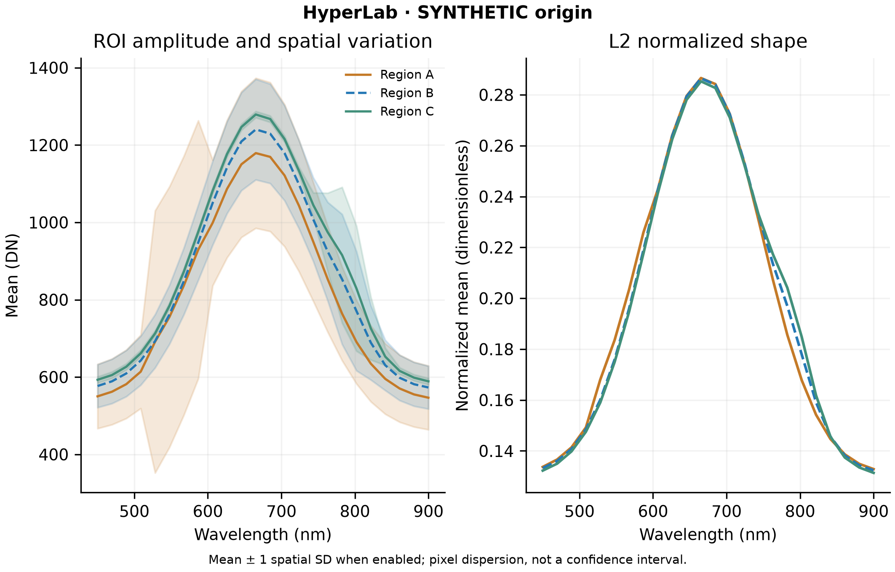

# Scientific figures

In 0.3.1, **Compare ROIs** on one raw sensor plane shows ROI means with
mean +/- 1 spatial SD error bars and a second panel of intensity distributions.
The distributions use 64 shared bins and all pixels admitted by the selected
quality policy. Each nonempty density integrates to one, so ROIs of different
sizes can be compared; bin edges, counts and densities are saved in
`distributions.csv` and `plot.json`. Empty ROIs remain missing, not zero-valued.
The L2 option is hidden for one plane because its normalized scalar would always
be one. RGB channels and evidenced multi-band data keep their actual channel or
wavelength axes and the optional L2 panel. These are descriptive comparisons.

The interactive renderer (pyqtgraph) and publication renderer (Matplotlib) consume
one computed PlotSpec. Export does not run a second scientific analysis. A figure
records source artifact/session/stream/frame, ROI bounds and names, features,
quality policy, counts, normalization, limits, colormap, units and caption.

| Figure | Required interpretation |
|---|---|
| ROI amplitude | Mean ±1 spatial SD (population ddof=0), pixel dispersion; no CI or independent-repeat claim |
| L2 shape | Common finite feature set; dimensionless; original amplitude stays visible |
| Wavelength curve | Only with a declared wavelength array and unit; declared is distinct from independently verified |
| Unknown scan axis | Scan state index, never invented nanometres |
| RGB / Bayer | Categorical colour channels / sensor DN summary, not a measured spectrum |
| Difference | Signed units, zero-centered diverging map |
| Ratio | A/B, dimensionless, semantic center 1; invalid/low denominator masked |
| Angle | Sequential map, rad or deg; not defect probability |
| PCA | PC score units follow mean-centered input; loadings and explained variance retain used features |
| Time trend | Known recorded host clock or frame index; displayed subset or all persisted frames is explicit |

Diagnostic policy retains known saturated samples. Quantitative policy excludes
them consistently with masks, ignore sentinels and bad bands. Histogram values
come from the same image selection and sampled stride as display limits; sample
count/denominator and raw versus CFA-derived values are recorded. All-invalid
selections show an empty state. Display stretch never modifies raw values.

## Export

Select Figure export in Analysis; choose current chart or derived map, title,
width/height (mm) and DPI. The directory contains:

- `figure.svg`, `figure.pdf`, `figure.png`: annotated renders, editable text in
  SVG/PDF; dense maps are rasterized inside vector figures.
- `plot.json`: PlotSpec, source/quality/ROI/feature metadata, dimensions, version.
- `series.csv`: the actual x/y/SD/normalized curve values.
- `values.npy`, `valid.npy`: numerical map and mask for map bundles.

Public examples exclude private file paths and identifiers. Local PlotSpec files
can contain private provenance; review before sharing. Titles/captions retain
SYNTHETIC/REPLAY/LIVE origin. An origin label does not certify quantitative
measurement eligibility. Source eligibility can be unknown or false.



Reproduce the example bundles with a normal installed package:

```powershell
python -m hyperlab figure-demo --output "$env:USERPROFILE\Documents\HyperLabFigures"
```

The generator creates ROI, difference, PC2 score, explained variance and loading
figures from the built-in synthetic cube. Values are intentionally illustrative;
saturated and invalid synthetic samples are not hidden to improve appearance.
Numerical regression compares CSV/NPY with PlotSpec and checks text in SVG.
Rendered PNGs were visually inspected for readable titles, units, legends and
captions. These are research figure tools, not a claim of journal acceptance.
